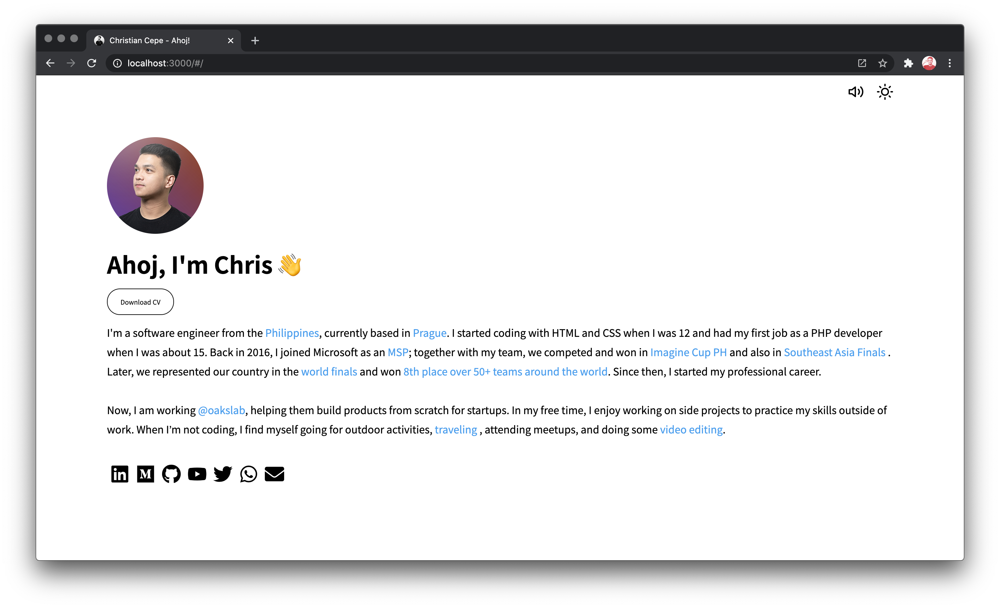

## Getting Started 🚀

Clone the repository.

    git clone https://github.com/chcepe/chcepe.github.io.git

Install the project dependencies:

    yarn
    # or
    npm install

Start the development server:

    yarn start
    # or
    npm run start

Browse [localhost:3000](http://localhost:3000/) in your browser of choice

## License 🙌

[chcepe.github.io](https://github.com/chcepe/chcepe.github.io) is distributed under the MIT License, available in this repository.

All contributions are assumed to be also licensed under the same.
